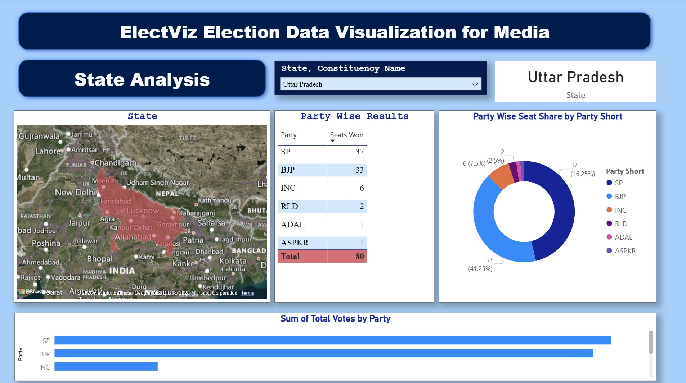
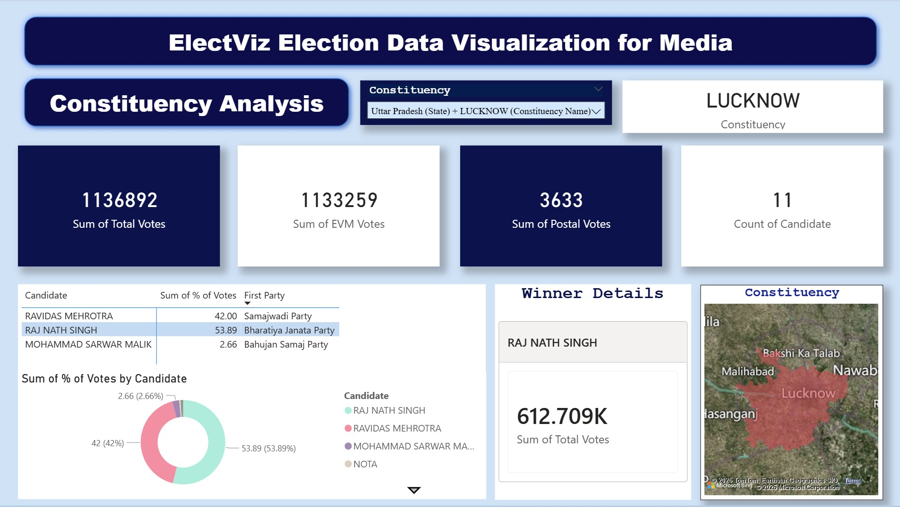
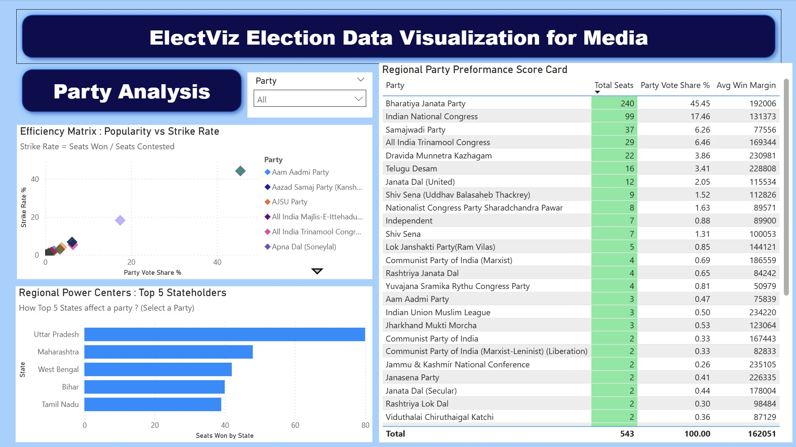
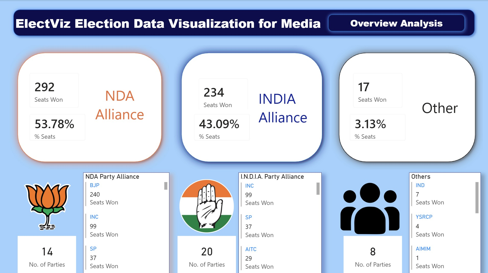

Election Analytics Dashboard (Power BI)

This project presents a comprehensive Election Analytics Dashboard developed using Power BI, designed to provide meaningful insights into electoral outcomes. It enables users to analyze party performance, alliance structures, and voting patterns through structured and interactive visualizations.
The dashboard supports data-driven analysis and enhances understanding of election data.

Key Features:
-In-depth party-wise performance evaluation
-Systematic classification of political alliances (NDA, I.N.D.I.A., Others)
-Clear visualization of seat distribution
-Interactive filters and dynamic slicers for customized analysis
-Region and state-level breakdown of results
-Comparative and trend-based analysis
-Technology Stack
-Power BI (.pbix)
-Data Transformation: Power Query
-Data Modeling and Calculations: DAX (Data Analysis Expressions)

Dashboard Screenshots:
### State Analysis

### Constituency Analysis

### Party Analysis

### Overview Analysis

Key Insights:
-Identification of leading political alliances and their dominance
-Comparative assessment of major political parties
-Regional disparities in electoral outcomes
-Constituency-level distribution patterns
-Usage Instructions
-Download the .pbix file from this repository
-Open it using Power BI Desktop
-Use the interactive features to explore the dashboard
-Future Enhancements
-Addition of time-series electoral trends
-Integration of real-time datasets
-Implementation of predictive models for forecasting outcomes

Note:
Codes for Measures and Calculations are provided.

Contributions:
Contributions are welcome. Please fork the repository and submit a pull request for any improvements.
